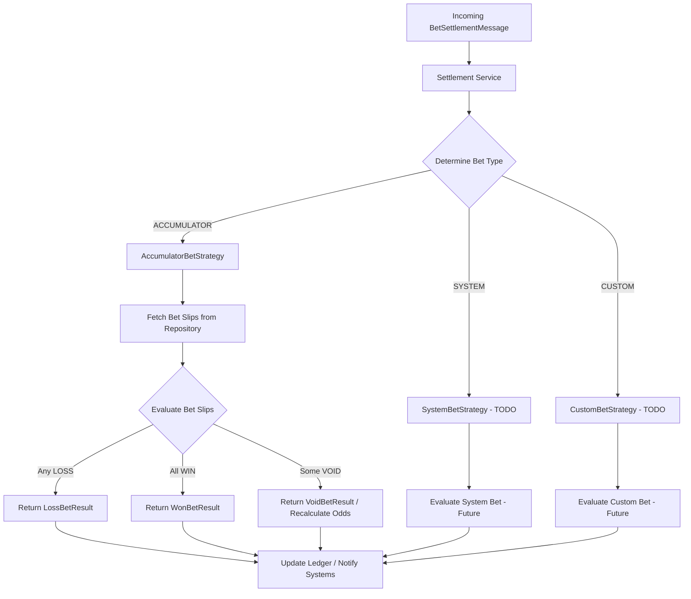

---

# Bet Settlement Strategy Framework

## Overview

This module implements a **framework for bet settlement strategies** in the Sports Betting application.
Currently, it includes an implementation for **Accumulator Bets** (`AccumulatorBetStrategy`) as part of the settlement service.

The framework is designed to be **extensible**, allowing future support for other bet types such as **Single Bets** or **Custom Bets**.

---

## Current Implementation: Accumulator Bet

The `AccumulatorBetStrategy` performs the following:

1. Fetches all bet slip statuses (legs) for the accumulator bet from the repository.
2. Counts wins, losses, and voids.
3. Determines the overall bet result:

    * **Loss:** Any leg lost → entire accumulator loses.
    * **Win:** All legs won → full payout.
    * **Void:** Some legs voided → placeholder for recalculating odds and applying void factor.
4. Returns a `BetResult` object (`WonBetResult`, `LossBetResult`, `VoidBetResult`) representing the outcome.

> **Note:** Single and custom bets are not implemented in this module. They are out of scope for the current assignment, but the framework is ready to support them in the future.

---

## TODOs and Future Considerations

The following items would be considered if more time were available:

1. **Void Bet Handling and Odds Recalculation**

    * Currently, `VoidBetResult` contains `null` odds.
    * Future work would recalculate the total odds for remaining valid legs and adjust payouts accordingly.

2. **Single and Custom Bet Strategies**

    * Implement separate strategies (`SingleBetStrategy`, `CustomBetStrategy`) following the `ResultingStrategy` interface.
    * Ensures consistent processing across all bet types.

3. **Error Handling and Logging Enhancements**

    * Add robust handling for missing or invalid bet slip data.
    * Improve logging to capture deserialization issues or repository failures.

4. **Performance Optimizations**

    * For large accumulators, consider batch queries or asynchronous processing.

5. **Integration with Settlement Events**

    * Settlement results could trigger notifications, ledger updates, or downstream services in a production system.

6. **Unit Tests and Validation**

    * Cover edge cases such as all voids, partial wins, or mixed statuses to ensure correctness.
---

## Extending the Framework

1. Create a new strategy implementing `ResultingStrategy`.
2. Annotate it with `@Service("<BET_TYPE_NAME>")`.
3. Implement the `result(Bet bet)` method to compute the outcome.
4. The settlement service will automatically pick the correct strategy based on the bet type.

---

## Summary

This framework establishes a **robust and extensible bet settlement system**:

* **Accumulator bets** are fully supported.
* **Single and custom bets** can be added without changes to existing logic.
* The listed TODOs provide a roadmap for a **production-ready settlement module**.

---

